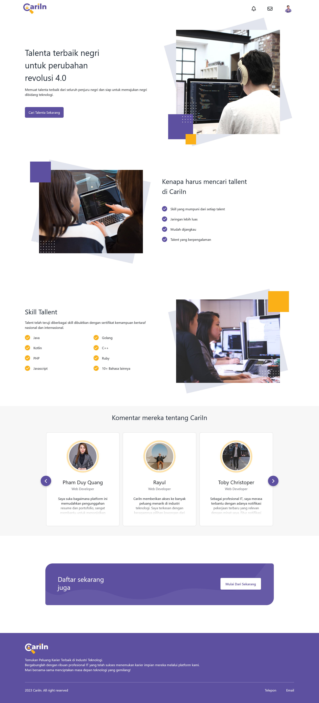
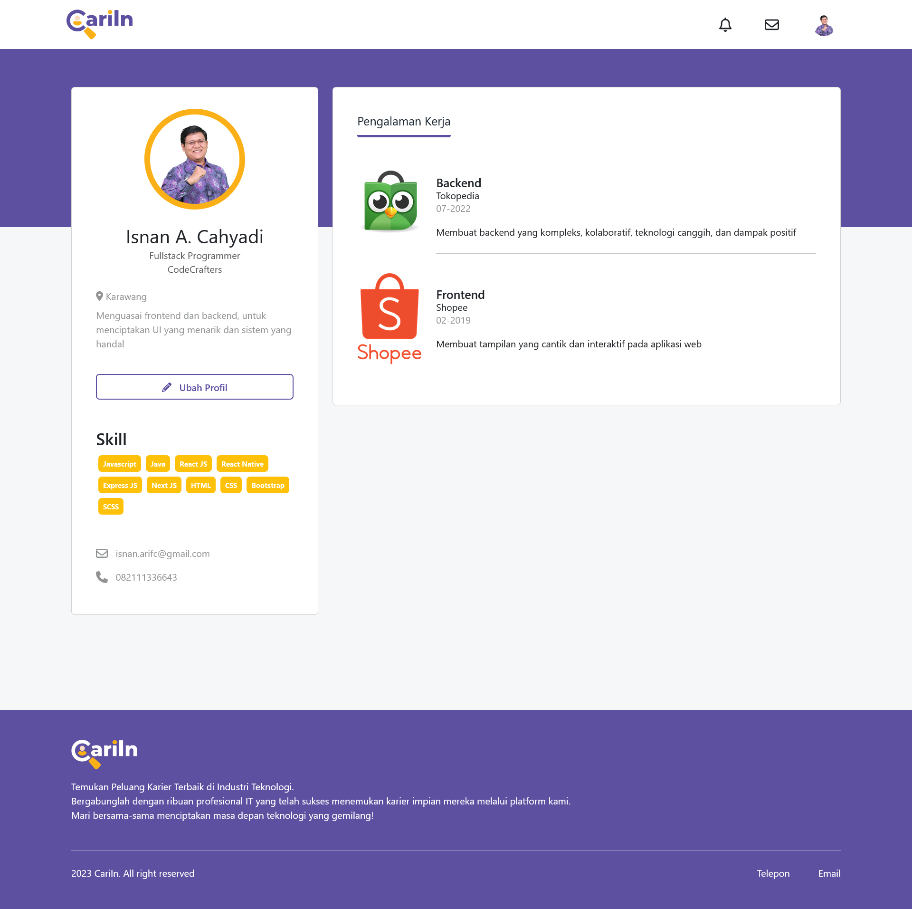
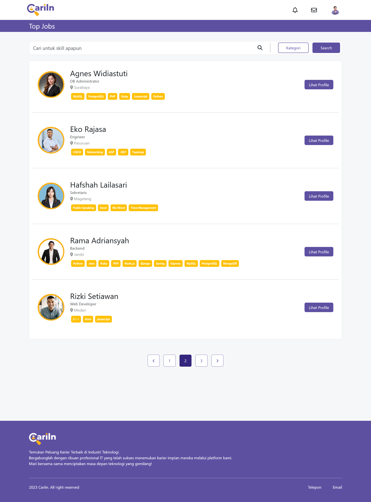
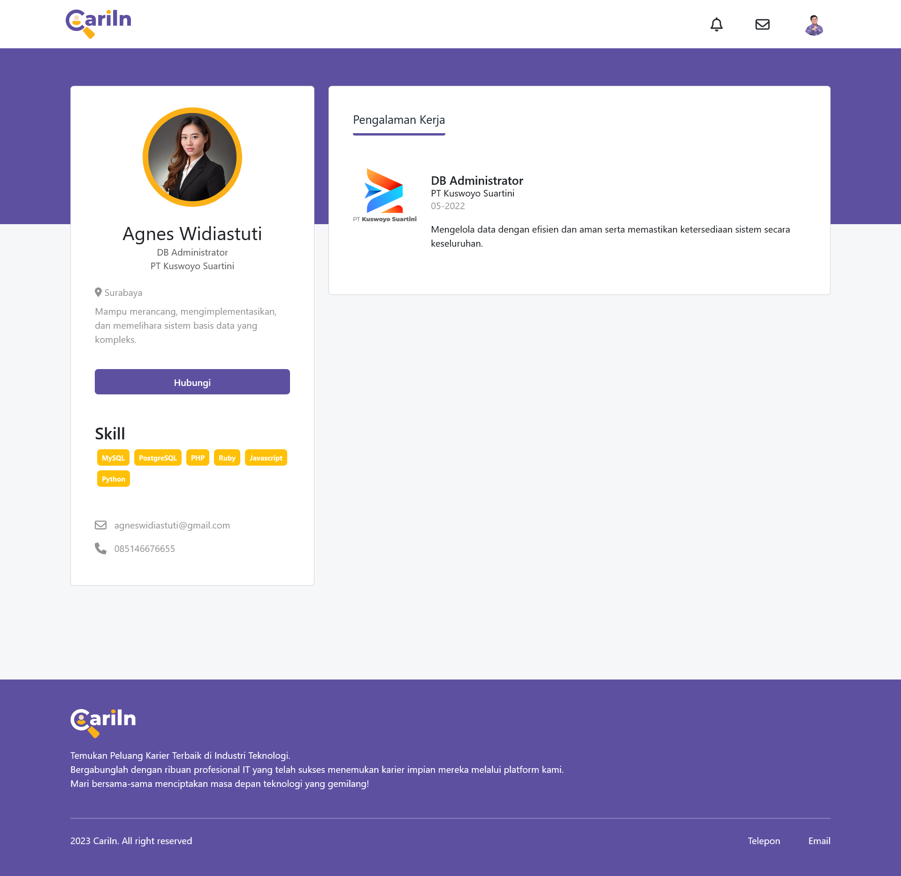

# CariIn

## Table of Contents

- [Introduction](#introduction)
- [Demo](#demo)
- [Technologies Used](#technologies-used)
- [Installation](#installation)
- [Configuration](#configuration)
- [Features](#features)
- [Screenshot](#screenshot)
- [Related Project](#related-project)
- [Authors and Contact Info](#authors-and-contact-info)

## Introduction

CariIn is a job posting platform that can bring together job seekers and recruiters as well as job seekers and fellow job seekers. With a comfortable and easy-to-use UI/UX as well as features that can help users connect, CariIn provides a job posting platform that recruiters and job seekers can rely on.

## Demo

Visit the link below for demo.

- :globe_with_meridians: [CariIn Demo](https://cariin.vercel.app/)

## Technologies Used

The project utilizes the following technologies and libraries:

- React.js: A popular JavaScript library for building user interfaces, used as the core frontend framework.
- Next.js: A framework for server-side rendered React applications, providing enhanced performance and SEO benefits.
- Node.js: The JavaScript runtime that powers the server-side backend.
- Axios: A promise-based HTTP client for making API requests from the frontend.
- Redux: A state management library to efficiently manage application state.
- Sass: A CSS preprocessor for easier and more organized styling.

## Installation

1. Clone this repository to your local machine:

```bash
git clone https://github.com/isnancahyadi/cariin.git
cd cariin
```

2. Install the required dependencies using npm or yarn:

```bash
npm install
# or
yarn install
```

## Configuration

Before running the application, you need to set up the configuration for Firebase authentication and API from backend. Create a .env file in the root directory of the project and add the following environment variable:

```bash
NEXT_PUBLIC_BACKEND_API=your_backend_api
```

## Features

- User Authentication: Allow users to sign up, log in, and manage their profiles.
- Job Browsing: Users can browse a list of job and view job details.
- Responsive Design: The application is responsive and adapts to various screen sizes.
- Send Message: Users can send message with job seekers through Email.

## Screenshot

<table>
    <tr>
        <td>1. Register Page</td>
        <td>2. Login Page</td>
        <td>3. Home Page</td>
    </tr>
    <tr>
        <td>
            
        </td>
        <td>
            
        </td>
        <td>
            
        </td>
    </tr>
    <tr>
        <td>4. My Profile Page</td>
        <td>5. Job List Page</td>
        <td>6. User Profile Page</td>
    </tr>
    <tr>
        <td>
            
        </td>
        <td>
            
        </td>
        <td>
            
        </td>
    </tr>
    <tr>
        <td>7. Message Page</td>
    </tr>
    <tr>
        <td>
            
        </td>
    </tr>
</table>

## Related Project

- :link: [CariIn API](https://github.com/isnancahyadi/cariin-api)

## Authors and Contact Info

For more information about this project or have any question or need help for development, feel free to contact me.

Isnan Arif Cahyadi

<div id="badges">
  <a href="https://www.linkedin.com/in/isnanarifcahyadi/">
    
  </a>
  <a href="mailto:isnan.arifc@gmail.com">
    
  </a>
</div>
